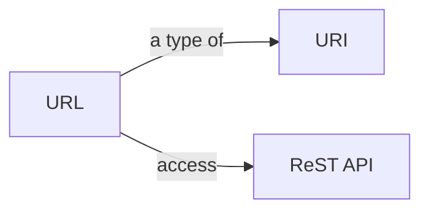
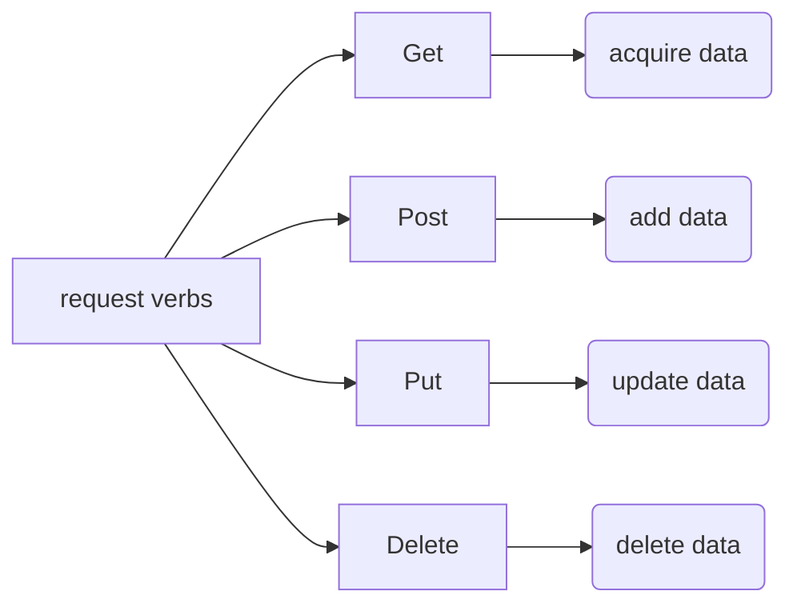

# AflowRestAPI
This repository shows the usage of Aflow Rest API[1] with python examples. If you are a tyro with REST API, here is everything you need to know.

The very first thing we should know is Aflow Rest API is a kind of rest API (Representational State Transfer Application Programing Interface), which accesses data through a string of characters that identify a specific resources called **URIs** (Uniform Resource Identifiers). **URL** (Uniform resource locator) is a kind of URI[2], which allows us to simply access data by inputting a specific website on a web browser.

There are mainly four request verbs of rest APIs:

In order to retrieving data from Aflow database, all we need is GET. 

[1] Taylor, R.H., et al., A RESTful API for exchanging materials data in the AFLOWLIB.org consortium. Computational Materials Science, 2014. 93: p. 178-192. https://doi.org/10.1016/j.commatsci.2014.05.014

[2] https://www.makeuseof.com/what-is-rest-api/
